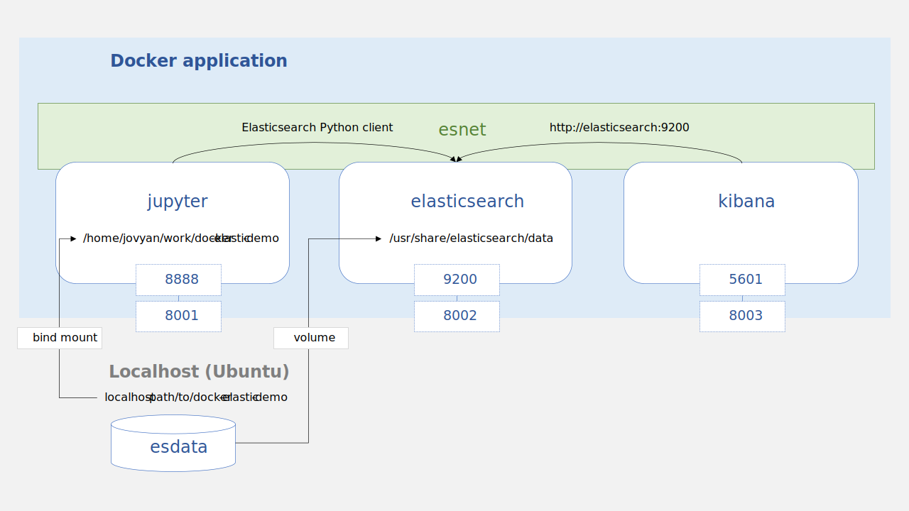

# Introduction

This guide starts up a multi-container [Docker](https://www.docker.com/resources/what-container) application with [JupyterLab](https://jupyter.org/), [Elasticsearch](https://www.elastic.co/what-is/elasticsearch), and [Kibana](https://www.elastic.co/what-is/kibana) on an Ubuntu host machine. If you are new to Elasticsearch and Kibana, check out the [Beginner's Crash Course to Elastic Stack](https://www.youtube.com/playlist?list=PL_mJOmq4zsHZYAyK606y7wjQtC0aoE6Es) on YouTube!

## Overview
- The **Quick Start** sets up:
  - a Jupyter container for data collection and analysis,
  - an Elasticsearch container for managing storage of the data, and
  - a Kibana container for visually examining the Elasticsearch indices.
- The **Service Configurations** section explains the settings used to set up the containers.
- The **Tips** section has commands for:
  - using bash inside the containers,
  - configuring ports,
  - backing up and restoring a data volume, and 
  - developing inside the containers with Visual Studio Code.

## What is a Docker container?

- "What is a Docker container and how is it different than a VM?" ([docs](https://www.docker.com/blog/the-10-most-common-questions-it-admins-ask-about-docker/))
  >Containerization leverages the kernel within the host operating system to run multiple root file systems. We call these root file systems “containers.” Each container shares the kernel within the host OS, allowing you to run multiple Docker containers on the same host. Unlike VMs, containers do not have an OS within it. They simply share the underlying kernel with the other containers. Each container running on a host is completely isolated so applications running on the same host are unaware of each other (you can use Docker Networking to create a multi-host overlay network that enables containers running on hosts to speak to one another). <br>
- `docker run` ([docs](https://docs.docker.com/engine/reference/run/))
  > When an operator executes `docker run`, the container process that runs is isolated in that it has its own file system, its own networking, and its own isolated process tree separate from the host.

# Quick Start
### 1. Install [Docker Engine for Ubuntu](https://docs.docker.com/engine/install/ubuntu/)
The Docker Engine runs on Linux distributions.
### 2. Install [Docker Compose v1.27.4](https://docs.docker.com/compose/install/)

  Download:
  ```
  sudo curl -L "https://github.com/docker/compose/releases/download/1.27.4/docker-compose-$(uname -s)-$(uname -m)" -o /usr/local/bin/docker-compose
  ```

  Apply executable permissions to the binary:

  ```
  sudo chmod +x /usr/local/bin/docker-compose
  ```

### 3. Clone this directory to your machine

Navigate to the `config` directory and add a `.env` file with the following lines:
```
MY_USERNAME=myusername
COMPOSE_PROJECT_NAME=demo
JUPYTER_TOKEN=changeme
ELASTIC_USERNAME=elastic
ELASTIC_PASSWORD=changemetoo

```
- `MY_USERNAME`: used to label your images
- `COMPOSE_PROJECT_NAME`: prefix for each container's name
- `JUPYTER_TOKEN`: token for logging into the Jupyter container
- `ELASTIC_USERNAME`: "elastic" is the [built-in superuser](https://www.elastic.co/guide/en/elasticsearch/reference/7.11/built-in-users.html)

### 4. Bring up the containers

`docker-compose.yml` is the configuration file for bringing up the containers. While you are in the `config` directory, run the command below. The environment variables in `.env` will feed into the Docker Compose process.
```
docker-compose up -d
```

The [`docker-compose up`](https://docs.docker.com/compose/reference/up/) command tells Docker to build the images based on the Dockerfiles and to set up the containers with the specified configurations. The `-d` flag makes the containers run in the background in "detached" mode. The first time around, it'll probably take a couple minutes to download and build the images. Images act as blueprints for creating Docker containers, and subsequent times will run much faster as Docker will re-use images which already exist. To learn more about Docker Compose, see the [docs](https://docs.docker.com/compose/) and ["The Definitive Guide to Docker Compose"](https://gabrieltanner.org/blog/docker-compose).

You'll see quite a few messages, including:
```
Creating network "demo_esnet" with the default driver
Creating volume "demo_esdata" with local driver
Creating demo_jupyter_1       ... done
Creating demo_elasticsearch_1 ... done
Creating demo_kibana_1        ... done
```

You can see your active containers by entering `docker ps` in your terminal:

```
CONTAINER ID   IMAGE                                        COMMAND                  CREATED         STATUS         PORTS                                NAMES
0a5ba8eb681e   myusername/demo:kibana-enhanced-7.11.0       "/bin/tini -- /usr/l…"   3 seconds ago   Up 2 seconds   127.0.0.1:8003->5601/tcp             demo_kibana_1
5c9dc8d6bbf9   myusername/demo:jupyter-minimal-2021-10-17   "tini -g -- start-no…"   4 seconds ago   Up 3 seconds   127.0.0.1:8001->8888/tcp             demo_jupyter_1
037ee213d2a4   myusername/demo:elasticsearch-7.11.0         "/bin/tini -- /usr/l…"   4 seconds ago   Up 3 seconds   9300/tcp, 127.0.0.1:8002->9200/tcp   demo_elasticsearch_1
```

You should be able to reach:
- the Jupyterlab container at [localhost:8001](http://localhost:8001),
- the Elasticsearch container at [localhost:8002](http://localhost:8002), and
- the Kibana container at [localhost:8003](http://localhost:8003).

You should see security prompts for each service (if the prompts don't show up, it might help to try out a different browser). Refer to the variables in `.env` to find the login information.

### 5. Try out the demo
The demo is a Python-based Jupyter notebook which contains:
- an example of how to add, retrieve, and delete a document using the [Elasticsearch Python Client](https://elasticsearch-py.readthedocs.io/en/v7.11.0/)
- an example showing how a document persists even if the containers are thrown away
- a very basic intro to Kibana

### 6. Close down the multi-container application
When you're done, run:
```
docker-compose down
```

This will stop the three containers and the network which links them together. You should see these messages:

```
Stopping demo_kibana_1        ... done
Stopping demo_elasticsearch_1 ... done
Stopping demo_jupyter_1       ... done
Removing demo_kibana_1        ... done
Removing demo_elasticsearch_1 ... done
Removing demo_jupyter_1       ... done
Removing network demo_esnet
```

The Docker volume, `demo_esdata`, will stick around on the host machine. If you run `docker-compose up -d` again, you'll see that it persists any documents you stored through Elasticsearch.

### 7. Manage the volume

To see the existing volumes:

```
docker volume ls
```

To remove the demo volume:

```
docker volume rm demo_esdata
```

### 8. Manage the images

To see the existing top-level images:

```
docker images
```

To remove a Docker image by ID:

```
docker rmi <IMAGE ID>
```

To remove all images without at least one container associated to them:

```
docker image prune -a
```

# Service Configurations

Here's a high-level overview of the Docker application which is spun up when you use `docker-compose up -d`. The application is made up of three containers which are connected through an internal network called `esnet`, and its data persist in a volume called `esdata` which is housed on the host machine.



## Jupyter

- `build`: build the JupyterLab service using a Dockerfile called `dockerfile-jupyter`. This file uses an official image of Jupyter's minimal-notebook (see more options [here](https://jupyter-docker-stacks.readthedocs.io/en/latest/using/selecting.html#core-stacks)) and installs the packages specified in `requirements.txt` inside the container.
- `context`: tells Docker Compose where to look for the dockerfile
- `image`: the child image is given a name based off the official image which it builds from

```
  jupyter:
    build:
      context: .
      dockerfile: dockerfile-jupyter
    image: ${MY_USERNAME}/${COMPOSE_PROJECT_NAME}:jupyter-minimal-2021-10-17
```

- `restart`: restart the container automatically unless the user explicitly stops it with [`docker stop`](https://docs.docker.com/engine/reference/commandline/stop/)
```
    restart: unless-stopped
```

- Enable the JupyterLab interface and set the login token using the `JUPYTER_TOKEN` value from `.env`
```
    environment:
      - JUPYTER_ENABLE_LAB=yes
      - JUPYTER_TOKEN=${JUPYTER_TOKEN}
```

- Use a reverse proxy to make the container's Jupyter `8888` port accessible to the host machine's `8001` port. The reverse proxy is specified by `127.0.0.1:<PORT>`, which ensures that the container's port is only accessible to the host machine and not exposed publicly ([see the Elasticsearch docs for more details](https://www.elastic.co/guide/en/elasticsearch/reference/current/docker.html#:~:text=If%20you%20don%E2%80%99t%20want%20to%20expose%20port%209200%20and%20instead%20use%20a%20reverse%20proxy%2C%20replace%209200%3A9200%20with%20127.0.0.1%3A9200%3A9200%20in%20the%20docker-compose.yml%20file.%20Elasticsearch%20will%20then%20only%20be%20accessible%20from%20the%20host%20machine%20itself.)).
```
    ports:
      - "127.0.0.1:8001:8888"
```

- Limit the container's memory to 2GB of the host machine's capacity. You can use [`docker stats`](https://docs.docker.com/engine/reference/commandline/stats/) to see the CPU and memory usage of active containers.

```
    mem_limit: 2g
```

- Use a [bind mount](https://docs.docker.com/storage/bind-mounts/) to make directories on the host machine available within a container. It's better to only mount what you need (i.e., pick specific subdirectories rather than mounting your entire home directory). The `docker-compose.yml` shows how to bind mount the cloned repo to the container. If you want to mount another directory, you can do that by adding an entry as shown below.
- Please note that it's not possible to specify the `source` and `target` values from the `.env` file using [long syntax](https://docs.docker.com/compose/compose-file/compose-file-v3/#:~:text=my_other_config%3A%0A%20%20%20%20external%3A%20true-,Long%20syntax,-The%20long%20syntax) (see this [Github issue](https://github.com/docker/compose/pull/3108#issuecomment-248038373) as cited in [this Stack Overflow post](https://stackoverflow.com/questions/45103843/using-environment-variable-for-volume-name-in-docker-compose/45674488#45674488))
```
    volumes:
      - type: bind
        source: ..                                    # the parent directory relative to docker-compose.yml
        target: /home/jovyan/work/docker-elastic-demo                
      - type: bind                                    # this is a 'bind' mount
        source: <PATH-TO-ANOTHER-HOST-DIRECTORY>      # directory on the host machine
        target: /home/jovyan/work/<DIRECTORY-NAME>    # directory within the container
```

- Attach the container to the network (`esnet` is specified near the end of `docker-compose.yml`)
```
    networks:
      - esnet   
```
## Elasticsearch

- Build the Elasticsearch service using `dockerfile-elasticsearch`. It pulls the official image for version 7.11.0 (see more options [here](https://www.docker.elastic.co/r/elasticsearch)).
```
  elasticsearch:
    build:
      context: .
      dockerfile: dockerfile-elasticsearch
    image: ${MY_USERNAME}/${COMPOSE_PROJECT_NAME}:elasticsearch-7.11.0
    restart: unless-stopped
```

- `ports`: use a reverse proxy to make the container's `9200` port accessible to the host machine's `8002` port
- `expose`: expose the container's `9200` port to other containers attached on the `esnet` network. This is technically redundant since the `9200` port is already available to the host through `ports`. It is necessary, however, if you remove the `ports` section. In that case, it will make sure that the Kibana service will still know how to connect to the Elasticsearch service.
```
    ports:
      - "127.0.0.1:8002:9200"
    expose:
      - "9200"
```

- To use more than a single node, see the [docs](https://www.elastic.co/guide/en/elasticsearch/reference/7.11/docker.html#docker-compose-file) for "Starting a multi-node cluster with Docker Compose"

```
    environment:
      - discovery.type=single-node
```

- "swapping needs to be disabled for performance and node stability" [(docs)](https://www.elastic.co/guide/en/elasticsearch/reference/7.11/docker.html#_disable_swapping)
```
    environment:
      ...
      - bootstrap.memory_lock=true
    ...
    ulimits:
      memlock:
        soft: -1
        hard: -1
```

- Set the JVM heap size to "no more than 50% of your total memory" [(docs)](https://www.elastic.co/guide/en/elasticsearch/reference/master//advanced-configuration.html#:~:text=When%20running%20in%20a%20container%2C%20such%20as%20Docker%2C%20total%20memory%20is%20defined%20as%20the%20amount%20of%20memory%20visible%20to%20the%20container%2C%20not%20the%20total%20system%20memory%20on%20the%20host.)
- Limit the container's memory usage to 2GB of the host machine's capacity
```
    environment:
      ...
      - "ES_JAVA_OPTS=-Xms1g -Xmx1g"

    mem_limit: 2g
```

- Enable security features [(docs)](https://www.elastic.co/guide/en/elasticsearch/reference/7.11/security-settings.html)

```
    environment:
      ...
      - xpack.security.enabled=true
      - xpack.security.audit.enabled=true
      - ELASTIC_PASSWORD=${ELASTIC_PASSWORD}
```


- Use an external Docker volume to persist the data. The volume is named `esdata` (specified at the end of the `docker_compose.yml` file). The `target` is `/usr/share/elasticsearch/data`, as advised by the [docs](https://www.elastic.co/guide/en/elasticsearch/reference/current/docker.html#_always_bind_data_volumes).
- It's important to note that unlike the `volumes` section for the JupyterLab service, the `type` value here is `volume` and not `bind`. The `volume` type is generally preferred for persistent storage as it's fully managed by Docker and independent of the host machine's directory structure. See the [docs](https://docs.docker.com/storage/) and this [Stack Overflow explanation](https://stackoverflow.com/a/47152658) for more info.

```
    volumes:
      - type: volume
        source: esdata
        target: /usr/share/elasticsearch/data
```

- Attach the container to the network
```
    networks:
      - esnet
```

## Kibana

- `dockerfile_kibana` adds the [`kibana-enhanced-table`](https://github.com/fbaligand/kibana-enhanced-table) plugin to the official Kibana image (see more options [here](https://www.docker.elastic.co/r/kibana))
```
  kibana:
    build:
      context: .
      dockerfile: dockerfile-kibana
    image: ${MY_USERNAME}/${COMPOSE_PROJECT_NAME}:kibana-enhanced-7.11.0
    restart: unless-stopped
    ports:
      - "127.0.0.1:8003:5601"
```

- `ELASTICSEARCH_HOSTS`: connect to the Elasticsearch service
- `ELASTICSEARCH_USERNAME`, `ELASTICSEARCH_PASSWORD`: see `.env` for the values
```
    environment:
      - ELASTICSEARCH_HOSTS="http://elasticsearch:9200"
      - ELASTICSEARCH_USERNAME=${ELASTIC_USERNAME}
      - ELASTICSEARCH_PASSWORD=${ELASTIC_PASSWORD}
```

- Limit the container's memory usage to 2GB of the host machine's capacity
```
    mem_limit: 2g
```

- Attach the container to the network
```
    networks:
      - esnet
```

- Define the dependency order so that the Kibana service is started after the Elasticsearch service
```
    depends_on:
      - elasticsearch
```

## Networks

- Create a network which services can link to by referring to `esnet` ([Docker forum post about setting a global network name](https://forums.docker.com/t/set-default-network-name-for-compose/36779/2))
- `name`: name the network with the same format as the containers ([Docker forum post](https://forums.docker.com/t/set-default-network-name-for-compose/36779/3)). When you enter [`docker network ls`](https://docs.docker.com/engine/reference/commandline/network/) in the terminal, you'll see the network listed as `demo_esnet`.


```
networks:
  esnet:
    name: "${COMPOSE_PROJECT_NAME}_esnet"
```

## Volumes

- Containers are designed to be ephemeral and stateless. To avoid losing data when containers are thrown away, a Docker volume is created to persist the data. The Elasticsearch service links up to this volume by referring to `esdata`.
- `name`: name the volume with the same format as the containers. When you enter [`docker volume ls`](https://docs.docker.com/engine/reference/commandline/volume/) in your terminal, you'll see the volume listed as `demo_esdata`.
- `driver`: `local` creates the Docker volume on the host machine ([Stack Overflow post](https://stackoverflow.com/a/42195734))
```
volumes:
  esdata:
    name: "${COMPOSE_PROJECT_NAME}_esdata"
    driver: local
```

# Tips

- [Docker CLI Cheat-Sheet](https://github.com/xcad2k/cheat-sheets/blob/main/devops/dockercli-cheat-sheet.md)

## Use the bash shell inside a container
It can be useful to login as root if you need to run apt-get commands or to change file permissions.

```
# Jupyter container
docker exec -it -u root jupyter-demo /bin/bash    # as root
docker exec -it -u jovyan jupyter-demo /bin/bash  # as non-root user (jovyan)
```
- ["What is a jovyan?"](https://jupyter.readthedocs.io/en/latest/community/content-community.html#what-is-a-jovyan)

```
# Elastic container
docker exec -it -u root elastic-demo /bin/bash    # as root
```

```
# Kibana container
docker exec -it -u root elastic-demo /bin/bash    # as root
```

## Change the localhost ports
You can adjust the localhost port numbers under the `ports` section of each service in `docker-compose.yml`. For example, you can use the conventional ports by changing:
- `8001` to `8888` for JupyterLab,
- `8002` to `9200` for Elasticsearch, and
- `8003` to `5601` for Kibana.

You should then be able to reach:
- the Jupyterlab container at [localhost:8888](http://localhost:8888),
- the Elasticsearch container at [localhost:9200](http://localhost:9200), and
- the Kibana container at [localhost:5601](http://localhost:5601).

The `docker-compose.yml` file in this demo uses `8001`, `8002`, and `8003` to highlight that the left side refers to the port on the host machine and the right side refers to the port within the container (e.g., `127.0.0.1:8001:8888`).

## Local port forwarding through SSH

If the containers are running on a remote server, you can forward them to your local machine through SSH.<br>
See [this *explainshell* link](https://explainshell.com/explain?cmd=ssh+-f+-N+-L+127.0.0.1.8888%3A127.0.0.1%3A8001+servername) for a description of the command.

```
# Jupyter container
ssh -f -N -L 127.0.0.1:8888:127.0.0.1:8001 <server domain name>        # e.g., github.com

# Elasticsearch container
ssh -f -N -L 127.0.0.1:9200:127.0.0.1:8002 <server domain name>

# Kibana container
ssh -f -N -L 127.0.0.1:5601:127.0.0.1:8003  <server domain name>
```
You should then be able to reach:
- the Jupyterlab container at [localhost:8888](http://localhost:8888),
- the Elasticsearch container at [localhost:9200](http://localhost:9200), and
- the Kibana container at [localhost:5601](http://localhost:5601).

To stop port forwarding:

1. find the related process IDs
```
ps aux | grep -e 127.0.0.1:8001 -e 127.0.0.1:8002 -e 127.0.0.1:8003
```
2. and terminate them.

```
kill <PID>
```

## Backup and restore a data volume
This section is based on the examples provided in "Backup, restore, or migrate data volumes" ([docs](https://docs.docker.com/storage/volumes/#backup-restore-or-migrate-data-volumes)).
### Create a backup

1. Make a directory on your local machine to store your backup <br>
The backup process will output a gzip-compressed tar archive into this directory. In the instructions below, the path is assumed to be `home/myusername/volumes_backup`.

2. Stop the Elasticsearch container if it's running <br>
This helps avoid data corruption by making sure that Elasticsearch is not actively in-use during the backup process. Note that you are only stopping the container and not removing it so it is still accessible to `docker run` in the next step.
```
docker stop elasticsearch-myusername
```

3. Create the backup <br>
This Docker command creates a temporary container which is used as a helper for the backup process.
```
docker run --rm --volumes-from elasticsearch-myusername -v /home/myusername/volumes_backup:/backup ubuntu tar cvzf /backup/esdata-myusername-yyyymmdd.tar.gz /usr/share/elasticsearch/data
```
- `docker run`: start up a container
  - `--rm`: automatically remove the container when it exits (i.e., it is a temporary container)
  - `--volumes-from`: mount all volumes from the Elasticsearch container into the temporary container. This essentially mounts `esdata-myusername` (i.e., the volume you are backing up) to the temporary container's `/usr/share/elasticsearch/data` directory.
  - `-v`: bind mount the host's `/home/myusername/volumes_backup` directory into the temporary container's `/backup` directory. The `tar` command will output a `tar.gz` file into `/backup`. Since you used a bind mount, this file will be available on the host after the temporary container has been thrown away.
  - `ubuntu`: the temporary container is created using an Ubuntu Docker image
  - `tar cvzf <the-output-file> <the-content-to-backup>`
    - This command runs inside the temporary container
    - It creates a gzip-compressed tar archive of the temporary container's `/usr/share/elasticsearch/data` directory and outputs a file called `esdata-myusername-yyyymmdd.tar.gz` into the container's `/backup` directory

4. Check that the `tar.gz` file exists in the `volumes_backup` directory

### Restore from backup

1. Remove the containers and the existing volume
```
docker-compose down
docker volume rm esdata-myusername
```

2. Bring up a new set of containers along with a new volume
```
docker-compose up -d
```

3. Stop the Elasticsearch container
```
docker stop elasticsearch-myusername
```

4. Restore the Elasticsearch data from the backup <br>
This Docker command is similar to one used to create the `tar.gz` backup file. The difference is what happens inside the container. In this case, you use a bash shell inside the container (`bash -c "cd / && tar xvzf /backup/esdata-myusername-yyyymmdd.tar.gz"`). This bash command decompresses and untars the backup file into the root directory of the container. The root directory is used because the extracted backup retains the directory structure of `/usr/share/elasticsearch/data`.
```
docker run --rm --volumes-from elasticsearch-myusername -v /home/myusername/volumes_backup:/backup ubuntu bash -c "cd / && tar xvzf /backup/esdata-myusername-yyyymmdd.tar.gz"
```

5. Start the Elasticsearch container
```
docker start elasticsearch-myusername
```

6. Check if the data appear as expected in Elasticsearch and Kibana


## Developing inside containers using Visual Studio Code
Install:
- [Visual Studio Code](https://code.visualstudio.com/download)
- [Visual Studio Code Remote - Containers extension](https://code.visualstudio.com/docs/remote/containers)
>The Visual Studio Code Remote - Containers extension lets you use a Docker container as a full-featured development environment. It allows you to open any folder inside (or mounted into) a container and take advantage of Visual Studio Code's full feature set... This lets VS Code provide a local-quality development experience — including full IntelliSense (completions), code navigation, and debugging — regardless of where your tools (or code) are located.

If your containers are on a remote server, you can connect to the server through SSH:
- [Visual Studio Code Remote - SSH extension](https://code.visualstudio.com/docs/remote/ssh)
>The Visual Studio Code Remote - SSH extension allows you to open a remote folder on any remote machine, virtual machine, or container with a running SSH server and take full advantage of VS Code's feature set. Once connected to a server, you can interact with files and folders anywhere on the remote filesystem. No source code needs to be on your local machine to gain these benefits since the extension runs commands and other extensions directly on the remote machine. This lets VS Code provide a local-quality development experience — including full IntelliSense (completions), code navigation, and debugging — regardless of where your code is hosted.
